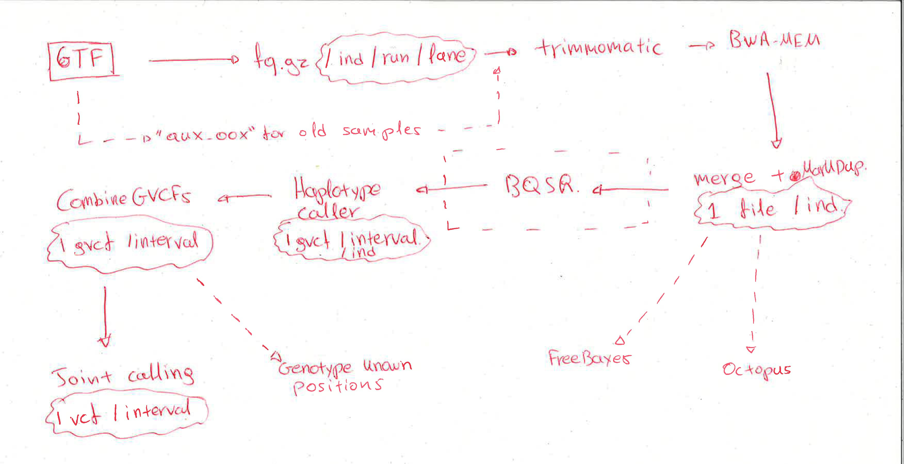

# snp_calling
Scripts for snp calling

The pipeline is 
1. Get scripts folder inside the your working directory (ex. data/scripts). 
2. Copy file links into a file in working directory and run locally or submit `0.0_getfix.sh link_file_name`
3. Submit 1.0_trim.slurm like so `awk '{print "sbatch 1.0_trim.slurm " $1}' ../uniq_prefix.list | bash `
4. Submit 1.1_map.slurm like so `awk '{print "sbatch 1.1_map.slurm " $1}' ../uniq_prefix.list | bash `
5. Now for the merge you no longer run / unique lane but per sample so `awk '{print "sbatch 1.2_mergeBAMs.slurm " $1}' ../uniq_samples.list | bash `
6. Now you have MarkedDuplicated bam files for each individual and you can choose to produce the individual gvcf with g1_make_gvcf.slurm like so
`sbatch g1_make_gvcf.slurm sample_name [1,2,...,10]` for each list of genomic intervals in the contig_intervals folder 
7. Then gather the 10 gvcf intervals with g2 as `sbatch g2_gather_intervals.slurm sample_name` to get 1 gvcf / ind or merge different individuals into 1 gvcf/interval with g3_merge_pop_gvcf.slurm that needs an input file that is just a list of files ex( sample1_interval1.gvcf.gz sample2_interval1.gvcf.gz ...)
8. You can now either genotype a set of known snps with g0 at the total individual gvcf (output of g2) or do a joint calling with g4.  
9. The steps are broadly illustrated in the following image but detailed in the wiki (in progress):

# make_fasta_mask  

The directory contains annotated scripts to create a bed mask of 'bad' regions of the genome based on http://lh3lh3.users.sourceforge.net/snpable.shtml and hints from Milan Malinsky. 

# contig_intervals

A directory with the unzip reference intervals used when splitting SNP-calling at the final Step. 

